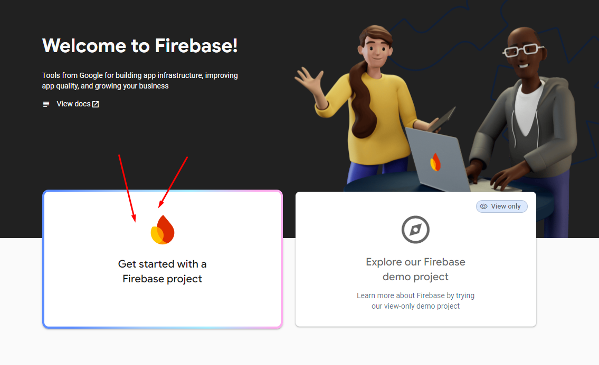
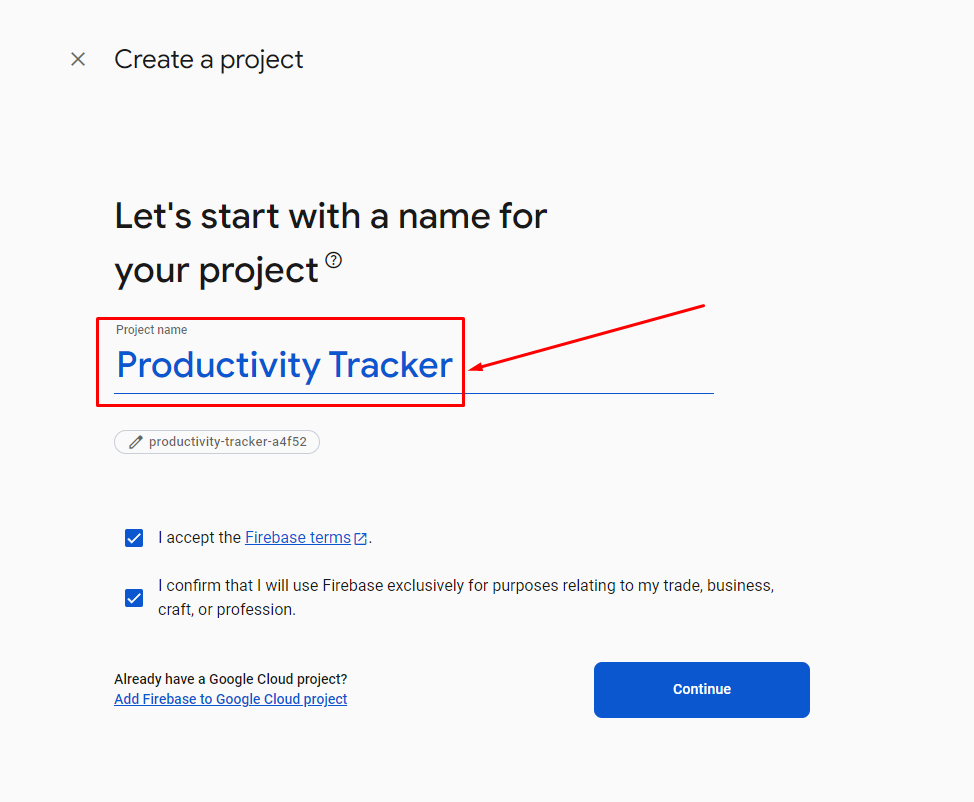
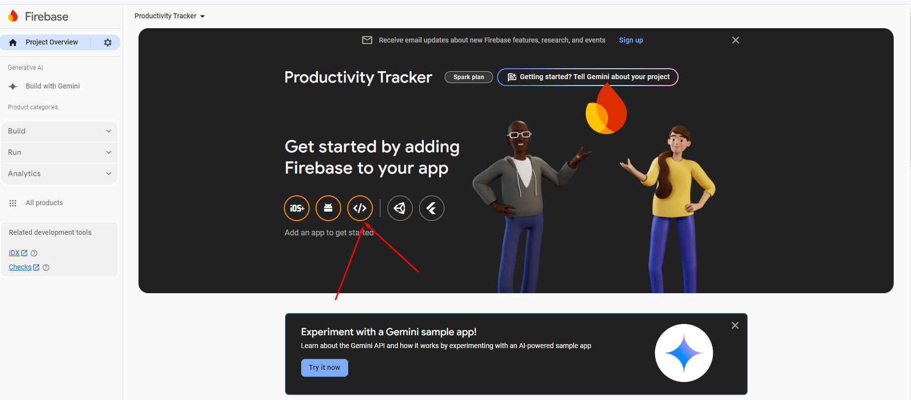
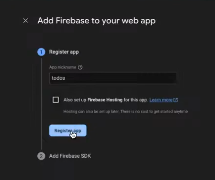
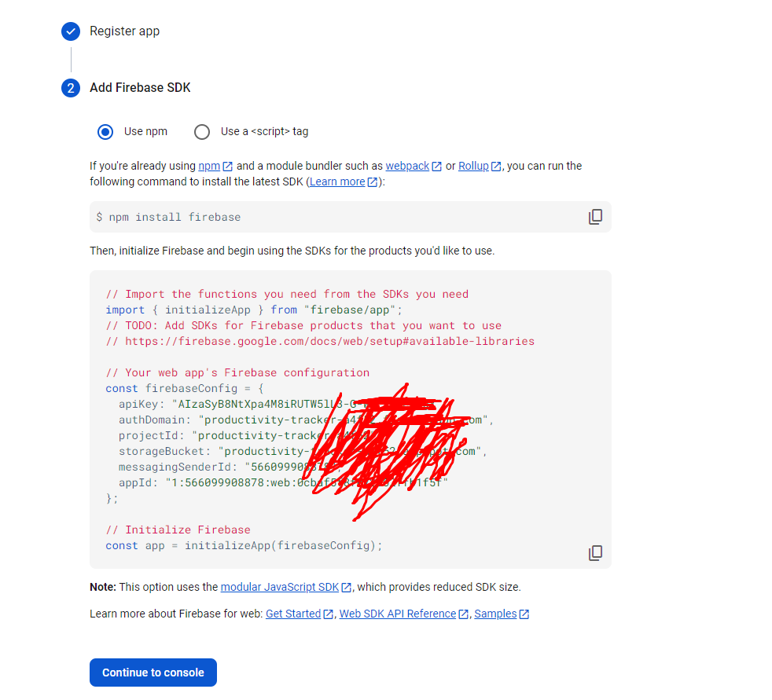
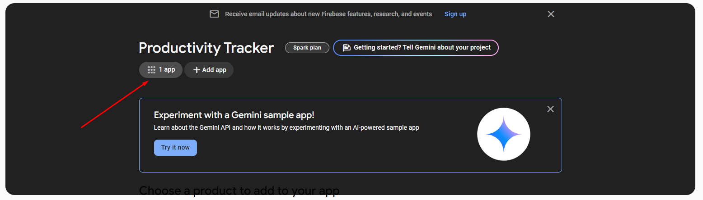
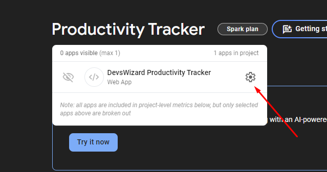
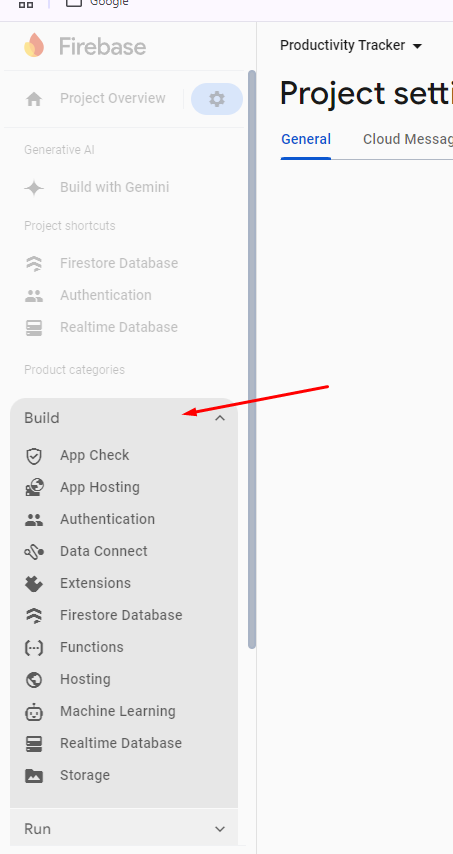

import { Callout, FileTree } from "nextra/components";

### Installation initial process

[https://console.firebase.google.com/](https://console.firebase.google.com/) প্রথমেই একটা গুগল একাউন্ট বা জিমেইলে লগিন করে নিতে হবে আর firebase console -এ যেতে হবে। এরপরে নিচে দেখানো স্ক্রিন আসবে, সেখান থেকে `Get started with a Firebase project` এ ক্লিক করতে হবে।



<Callout type="info" emoji="">
  এখন Project creation screen থেকে নিজের পছন্দমত নাম দিয়ে `Continue` button এ
  ক্লিক করতে হবে। একটু সময় প্রয়োজন হবে নতুন প্রজেক্ট ক্রিয়েট করতে। আমাদেরকে
  ততক্ষণ অপেক্ষা করতে হবে।
</Callout>


<Callout type="info" emoji="">
Project create হয়ে গেলে ঐ প্রজেক্টের dashboard এ নিয়ে যাবে, সেখানে নিচের মত ইন্টারফেস দেখা যাবে। আর এই ইন্টারফেস থেকে মার্কিং করা `</>` symbol এর বাটনে ক্লিক করতে হবে।
</Callout>


<Callout type="info" emoji="">
  আগের স্ক্রিনশটে দেখানো মার্কিং অনুযায়ী ক্লিক করলে নিচের ইন্টারফেস আসবে। এই
  ইন্টারফেসে APP এর নাম দিতে হবে। উল্লেখ্য, একটা প্রজেক্টের মধ্যে একাধিক app
  বানানো যাবে।
</Callout>


<Callout type="info" emoji="">
  App Register হয়ে গেলে নিচের ছবির মত আসবে যেখানে আমাদের বানানো app এর সকল
  ক্রিডেন্টশিয়াল থাকবে। এটা খুবই সেন্সিটিভ ডেটা, তাই ভালোভাবে সংরক্ষণ করতে হবে।
</Callout>


<Callout type="info" emoji="">
  আগের স্টেপে `Continue to console` এ ক্লিক করলে project এর dashboard -এ নিয়ে
  আসবে, যেখান থেকে আমাদের registerd app দেখা যাবে এবং সেই app এর settings এ
  যাওয়া যাবে।
</Callout>




<Callout type="info" emoji="">
  App এর মধ্যে আসলে Sidebar এ `Build` এর মধ্যে সব প্রয়োজনীয় service পাওয়া যাবে।
</Callout>
<Callout type="warning" emoji="">
  - Firestore Database (এটি Database হিসেবে কাজ করবে।)
</Callout>


## React project file structure

<FileTree>
  <FileTree.Folder name="Project Folder" defaultOpen>
    <FileTree.File name=".env" />
    <FileTree.Folder name="src" defaultOpen>
      <FileTree.File name="Main.jsx" />
      <FileTree.File name="App.jsx" />
      <FileTree.Folder name="firebase" defaultOpen>
        <FileTree.File name="firebaseInitialise.js" />
        <FileTree.File name="firebaseUtility.js" />
      </FileTree.Folder>
    </FileTree.Folder>
  </FileTree.Folder>
</FileTree>

```js copy filename=".env"
VITE_FIREBASE_API_KEY = AIzaSyB8NtX456
VITE_AUTH_DOMAIN = producti-adsh-5852.firebaseapp.com
VITE_PROJECT_ID = adfre-asdfas-a4f52
VITE_STORAGE_BUCKET = dfgr-tracker-dffsa.appspot.com
VITE_MESSAGING_SENDER_ID = 5668
VITE_APP_ID = 1:5464545231:web:56564dsfas
```

```js copy filename="firebaseInitialise.js"
// Import the functions you need from the SDKs you need
import { initializeApp } from "firebase/app";
import { getFirestore } from "firebase/firestore";

// TODO: Add SDKs for Firebase products that you want to use
// https://firebase.google.com/docs/web/setup#available-libraries

// Your web app's Firebase configuration
const firebaseConfig = {
  apiKey: import.meta.env.VITE_FIREBASE_API_KEY,
  authDomain: import.meta.env.VITE_AUTH_DOMAIN,
  projectId: import.meta.env.VITE_PROJECT_ID,
  storageBucket: import.meta.env.VITE_STORAGE_BUCKET,
  messagingSenderId: import.meta.env.VITE_MESSAGING_SENDER_ID,
  appId: import.meta.env.VITE_APP_ID,
};

// Initialize Firebase & export
export const firebaseApp = initializeApp(firebaseConfig);

// Initialize database & export
export const fireStoreDatabase = getFirestore(firebaseApp);
```
