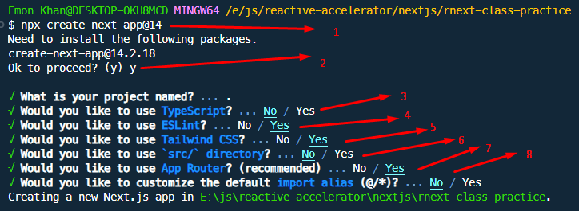

## Latest version install

install করার সময় nextjs suggested feature গুলো ব্যবহার করলে ভালো হবে।

```bash copy
npx create-next-app@latest
```

## Specific version install

specific vesion install করার জন্য `@` এর পরে version দিতে হবে।

```bash copy
npx create-next-app@14
```

## Installation process with cli

1. প্রথমে command দিতে হবে যে ভার্সন ইন্সটল করতে চাই সেটিসহ।
2. কোন version install হবে সেটি দেখিয়ে confirm করতে বলবে। confirm করতে `y` আর cancel করতে চাইলে `no` দিতে হবে।
3. প্রজেক্টে `TypeScript` ব্যবহার করতে চাইলে arrow right key press করে `Yes` select করে Enter press করতে হবে।
4. ESLint `Yes` রেখেই Enter press করতে হবে। এটি recommended.
5. প্রজেক্টে Tailwind CSS ব্যবহার করতে চাইলে `Yes` আর না চাইলে arrow left key press করে No select করে Enter press করতে হবে।
6. প্রজেক্টের সব file `src` directory তে রাখতে চাইলে `NO` আর সবগুলো root directory তেই রাখতে চাইল `Yes` রেখে Enter press করতে হবে।
7. React Server Component এর feature ব্যবহার করতে চাইলে App Router ব্যবহার করতে হবে এটি NextJS 13 version থেকে চালু হয়েছে। আর এটি Highly recommended.
8. import alias default রেখেই ব্যবহার করা ভালো।



উপরের প্রক্রিয়া সম্পন্ন করলেই nextjs app installation process complete হয়ে যাবে।

## Project run & build scripts

নিচের scripts গুলো automatic package.json file এ যুক্ত হয়ে যাবে।

```json filename="package.json" copy
{
  "scripts": {
    "dev": "next dev",
    "build": "next build",
    "start": "next start",
    "lint": "next lint"
  }
}
```

### Development environment run

Development environment এ প্রজেক্ট run করার জন্য নিচের কমান্ড দিতে হবে।

```bash copy
npm run dev
```

### Project build

Project build করার জন্য নিচের কমান্ড দিতে হবে।

```bash copy
npm run build
```

### Built website preview

Project build করার পরে build version run করার জন্য নিচের কমান্ড দিতে হবে।

```bash copy
npm start
```

### Linter fix

Linter এর কোন সমস্যা থাকলে সেটা automatic solve করার জন্য নিচের কমান্ড দিতে হবে।

```bash copy
npm run lint
```
