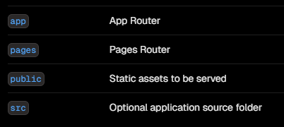
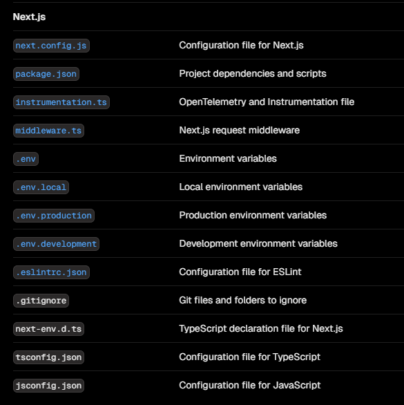
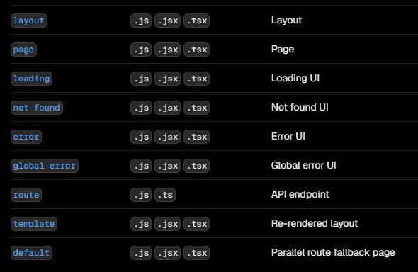

{/* dependencies */}
import { Callout } from 'nextra/components'

## Project Structure and Organization

nextjs মূলত file structure অনুযায়ীই কাজ করে থাকে। তাই nextjs ব্যবহার করার জন্য অবশ্যই nextjs এর নির্ধারিত file structure ব্যবহার করতে হবে।

## Root level folders

Top level / root level এ নিজের ফোল্ডারগুলো থাকবে। `pages` folder টা page route ব্যবহার করলে প্রয়োজন হবে, আর যদি file based routing system ব্যবহার করতে চাই তাহলে `app` folder প্রয়োজন হবে। `public` folder এর মধ্যে সব assets রাখতে হবে। আর `src` folder এর মধ্যে চাইলে আমাদের application এর সব ফাইল রেখে দিতে পারি এটি ঐচ্ছিক।

## Root level files

root level এ যে ফাইলগুলো থাকবে তা বিভিন্ন ধরনের configuration files হবে সবই। প্রতিটি ফাইলের পাশেই লিখা আছে কোন ফাইলে কি ধরনের configuration থাকবে।

## Routing files

নিচে প্রতিটা route এর মধ্যে কি কি file ব্যবহার করা যাবে এবং এগুলোর কাজ উল্লেখ করা হয়েছে।

<Callout type="warning" emoji="⚠️">
  এখানে ফাইলের নাম যেটি দেওয়া আছে হুবহু সেটিই ব্যবহার করতে হবে, অন্যথা কাজ করবে
  না।
</Callout>

