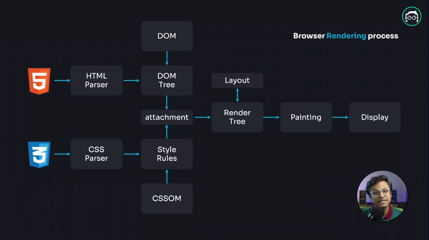
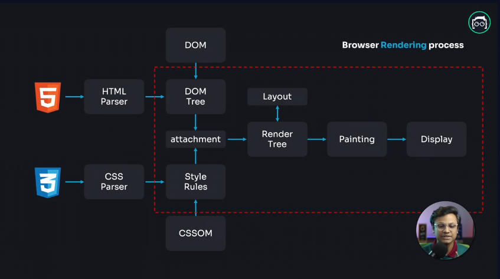

import { Callout, Steps } from "nextra/components";
import Link from 'next/link'

## `DOM` কি?

`DOM` এর সম্পূর্ণরুপ হচ্ছে `Document Object Model` যখন Javascript এর মাধ্যমে `HTML` এর মধ্যে কোন কিছু পরিবর্তন, পরিবর্ধন কিংবা নতুন কোন ইলিমেন্ট যুক্ত করার প্রয়োজন হয়, তখন এই `DOM` এর মাধ্যমে সেগুলো করা সম্ভব হয়ে থাকে।

## `CCSOM` কি?

`CCSOM` এর সম্পূর্ণরুপ হচ্ছে `CSS Object Model` যেটা CSS কে প্রোগ্রামিং দিয়ে নিয়ন্ত্রণ করতে সাহায্য করে, যেমন স্টাইল পরিবর্তন করা বা নতুন স্টাইল যোগ করা।

## `DOM` এবং `CSSOM` কিভাবে ব্রাউজারে Render হয়?

Browser রেন্ডার করার জন্য কয়েকটি স্টেপে কাজ করে থাকে, সেগুলো হচ্ছেঃ

<Steps>

{<h3>HTML পার্সিং ও DOM তৈরি</h3>}
ব্রাউজার প্রথমে HTML ফাইল থেকে HTML Parser এর মাধ্যমে DOM তৈরি করে।

{<h3>CSS পার্সিং ও CSSOM তৈরি</h3>}
এরপর CSS ফাইল থেকে CSS Parser এর মাধ্যমে CSSOM তৈরি করে।

{<h3>DOM ও CSSOM একত্রিত করে Render Tree তৈরি</h3>}
ব্রাউজার DOM এবং CSSOM একত্রিত করে Render Tree (রেন্ডার ট্রি) তৈরি করে। এই রেন্ডার ট্রি শুধু দৃশ্যমান উপাদানগুলো (যা স্ক্রিনে দেখা যাবে) ধারণ করে। যেমন, display: none; করা উপাদানগুলো এই ট্রিতে থাকে না।

{<h3>লেআউট নির্ধারণ</h3>}
রেন্ডার ট্রি থেকে ব্রাউজার প্রতিটি উপাদানের পজিশন, আকার, এবং অন্যান্য বৈশিষ্ট্য (যেমন মার্জিন, প্যাডিং) নির্ধারণ করে, যাকে লেআউট বলে।
এই লেআউট প্রক্রিয়ায় ব্রাউজার পেজের প্রতিটি উপাদান ঠিক কোন জায়গায় এবং কেমন আকারে থাকবে তা নির্ধারণ করে।

{<h3>পেইন্টিং ও রেন্ডারিং/Display</h3>}
লেআউট নির্ধারণ শেষে ব্রাউজার পেইন্টিং প্রক্রিয়া শুরু করে, যেখানে প্রতিটি উপাদানকে স্ক্রিনে আনা হয়।
শেষে, রেন্ডারিং প্রক্রিয়ায় পেজটি সম্পূর্ণভাবে স্ক্রিনে প্রদর্শিত হয়।

</Steps>

<Callout type="info">
  উপরের ছবিতে Browser Rendering Proccess Info chart এর মাধ্যমে দেখানো হয়েছে।
</Callout>

## Virtual DOM কি এবং কিভাবে কাজ করে?

### Virtual DOM

Virtual DOM হচ্ছে এমন একটি concept যেখানে DOM এর মত কিন্তু এটি Javascript এর Object. এই Virtual DOM বিভিন্ন Javascript Library নিজস্বভাবে তৈরি করে ব্যবহার করে থাকে। যেমনঃ ReactJS, VueJS এদের নিজস্ব Virtual DOM system রয়েছে। ReactJS, VueJS এরা সরাসরি DOM manipulate না করে, Virtual DOM এর মধ্যে সব পরিবর্তনগুলো করে actual DOM এর মধ্যে batch update করে থাকে। যার ফলে Browser Rendering process এর মধ্যকার painting process টা অনেক বেশি faster করে।

### Virtual DOM যেভাবে কাজ করে

<Steps>
{<h5>শুরুতে ভার্চুয়াল DOM তৈরি করা হয়</h5>}
রিয়্যাক্ট যখন প্রথমে একটি কম্পোনেন্ট রেন্ডার করে, তখন Virtual DOM এর একটি Tree তৈরি হয়।

{<h5>ডিফ (Diffing) এলগরিদম</h5>}
যখন UI তে কোনো পরিবর্তন হয় (যেমন কোনো স্টেট পরিবর্তন), তখন নতুন একটি Virtual DOM তৈরি হয়। রিয়্যাক্ট পুরানো Virtual DOM এর সাথে নতুন Virtual DOM এর তুলনা করে (এটিকে Diffing বলে) এবং দেখে কোন অংশটি পরিবর্তিত হয়েছে।

{<h5>ব্যাচ আপডেট</h5>}
পরিবর্তিত অংশগুলো চিহ্নিত করার পরে, রিয়্যাক্ট একত্রে ছোট ছোট আপডেটগুলো ব্যাচ আকারে আসল DOM এ প্রয়োগ করে। রিয়্যাক্ট এমন ভাবে আপডেটগুলো প্রয়োগ করে যাতে DOM ম্যানিপুলেশন যতটা সম্ভব কম হয়, কারণ DOM পরিবর্তন করা সময় সাপেক্ষ।

{<h5>Reconciliation (সামঞ্জস্যতা)</h5>}
পরিবর্তিত অংশগুলো শনাক্ত করার পরে, রিয়্যাক্ট শুধুমাত্র সেই অংশগুলোই সরাসরি DOM এ আপডেট করে। এই পুরো প্রক্রিয়াটিকে রিয়্যাক্ট reconciliation বলে। এটি নিশ্চিত করে যে DOM এ খুবই অল্প সংখ্যক পরিবর্তন ঘটানো হচ্ছে, যার ফলে অ্যাপ্লিকেশন দ্রুত কাজ করতে পারে।

</Steps>

## `DOM` কি Slow?

DOM slow না, slow হচ্ছে Browser Rendering process এর মধ্যে যে painting স্টেপ রয়েছে সেটি। যখন DOM এর মধ্যে কোন পরিবর্তন হয় তখন আবার Render Tree তৈরি হয় তারপরে Re-Paint করার মাধ্যমে স্ক্রিনে দেখায়। আর এখানেই DOM Manipulation process টা অনেক বেশি ধীরগতির হয়ে web application কে slow বানিয়ে দেয়।

<Callout type="info">
  নিচের ছবিতে যে লাল রঙের drawing দেখা যাচ্ছে সেই অংশটুকুই DOM এর মধ্যে কোন
  পরিবর্তন হলে আবার সম্পাদিত হয়। আর যখন render tree অনেক বড় হয় তখন অনেক বেশি সময়
  লাগে।
</Callout>

## ReactJS এর Virtual DOM কিভাবে web application এর performance বৃদ্ধি করে থাকে? 
DOM যদি কোন programming এর মাধ্যমে পরিবর্তন করা হয় তাহলে আগের <Link href="#dom-কি-slow" className="text-blue-500">`DOM` কি Slow?</Link> এখানে যেমনটা বলা হয়েছে কেন DOM Slow হয়, সেটারই সমাধান করে থাকে। ReactJS application এর মধ্যে DOM এর কোন পরিবর্তন হলে সেটা সরাসরি DOM এ আপডেট না করে Virtual DOM তৈরি করে আগের তৈরি করা Virtual DOM এর সাথে তুলনা করে। আর এই তুলনা করার পরে Actual DOM এর শুধুমাত্র যেখানে পরিবর্তন হয়েছে ঠিক সেখান থেকে নিচের child element গুলো আপডেট করে, parent element এর কোন পরিবর্তন করে না।  

